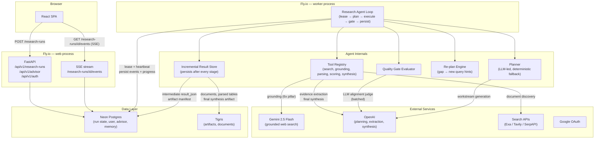
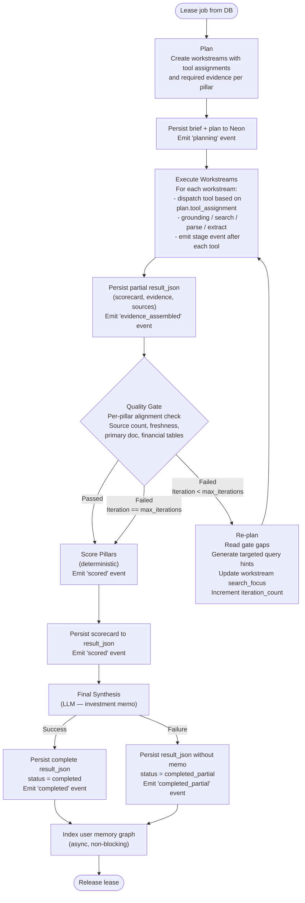

# Agentic System Design — Updated

This document replaces the hardcoded staged pipeline with a lean, truly agentic
research loop. It is designed to be implemented incrementally on top of the
existing codebase rather than as a rewrite.

---

## Design Principles

1. **The plan drives tool selection.** The planner's output is executable, not advisory.
2. **Intermediate results are always persisted.** A failure at any point leaves a recoverable state.
3. **Fallback is targeted re-planning, not a fixed legacy pipeline.**
4. **One process, one execution path.** No dual in-process/durable backends.
5. **Degrade loudly.** Every fallback emits an observable event.

---

## Updated Architecture



---

## The Agent Loop



---

## Key Changes From the Current Design

### 1. Plan is executable

Each workstream now has a `tool_assignment` field that tells the runner which
tool to call. The planner sets this based on the pillar type and available keys.

```python
class ResearchWorkstream(BaseModel):
    ...
    tool_assignment: Literal[
        "gemini_grounded",
        "search_and_parse",
        "sec_edgar",
        "technical_data",
        "legacy_pipeline",
    ] = "gemini_grounded"
    query_hints: list[str] = []  # generated by planner or re-plan engine
```

The runner dispatches based on `tool_assignment`:
```python
tool = self.tool_registry.get(workstream.tool_assignment)
result = tool.run(brief, workstream)
```

Adding a new tool (e.g., SEC EDGAR API) requires only registering it in the
`ToolRegistry` — no changes to the runner loop.

---

### 2. Intermediate results are persisted before synthesis

Scorecard, evidence, pillar assessments, and sources are written to `result_json`
before the synthesis LLM call. If synthesis fails, the run is marked
`completed_partial` and the user gets the scorecard + evidence without the memo.

```python
# Before synthesis
db.update_run(run_id, {
    "result_json": intermediate_result,
    "status": "synthesizing",
})

# After synthesis (or on synthesis failure)
try:
    synthesis = synthesize(...)
    final_result = {**intermediate_result, "final_synthesis": synthesis}
    db.update_run(run_id, {"result_json": final_result, "status": "completed"})
except Exception:
    db.update_run(run_id, {"status": "completed_partial"})
    emit_event(run_id, "synthesis_failed", {"fallback": "scorecard_only"})
```

---

### 3. Gate failure triggers targeted re-planning

Instead of running a fixed legacy pipeline, the re-plan engine reads gap reasons
from `QualityGateResult` and generates new `query_hints` for the failing workstreams.

```python
def replan_from_gaps(workstream: ResearchWorkstream, gate_result: QualityGateResult) -> None:
    """Update workstream query hints from gate gap reasons."""
    hints = []
    for gap in gate_result.gaps:
        if "no P/E" in gap:
            hints.append(f"{workstream.pillar_name} P/E multiple trailing forward analyst")
        if "no primary source" in gap:
            hints.append(f"{brief.entities[0].ticker} annual report investor relations site:ir.*")
        if "stale" in gap:
            hints.append(f"{brief.entities[0].name} latest results 2025")
    workstream.query_hints = hints
    workstream.status = WorkstreamStatus.PENDING
    workstream.iteration_count += 1
```

This replaces the `_run_targeted_fallbacks` method with a proper re-plan step
that feeds gap semantics back into search.

---

### 4. SSE replaces polling

The frontend connects to `GET /api/v1/research-runs/{run_id}/events` which
streams `run_events` rows as they are inserted. Each event is a `text/event-stream`
message with `event` and `data` fields.

```
event: stage
data: {"stage": "grounded_research", "pillar": "Financial Engine", "progress": 35}

event: stage
data: {"stage": "quality_gate", "passed": false, "iteration": 1}

event: completed
data: {"status": "completed", "overall_score": 72, "recommendation": "BUY"}
```

```python
@router.get("/research-runs/{run_id}/events")
async def stream_run_events(run_id: str, user=Depends(require_user)):
    async def event_generator():
        last_seen_id = 0
        while True:
            events = db.get_run_events_after(run_id, last_seen_id)
            for event in events:
                yield f"event: {event['stage']}\ndata: {json.dumps(event['payload'])}\n\n"
                last_seen_id = event["id"]
            if db.run_is_terminal(run_id):
                break
            await asyncio.sleep(1)
    return StreamingResponse(event_generator(), media_type="text/event-stream")
```

This eliminates ~100 unnecessary HTTP roundtrips per research run.

---

### 5. Single execution backend

The `InProcessOrchestrator` and `OrchestrationManager` in `orchestration.py` are
removed. All environments (local dev, staging, production) run durable mode.
Local dev uses SQLite + local artifact store. The worker polls every 2 seconds
with a 300-second lease — this is fine for a single developer.

The `RESEARCH_EXECUTION_BACKEND` env var is removed. `orchestration.py` is deleted.

---

### 6. All fallbacks are observable

Every degradation path emits an event to `run_events` and logs a warning:

| Fallback | Event emitted |
|----------|--------------|
| No Gemini key — grounding skipped | `grounding_unavailable` |
| OpenAI extraction fails — keyword fallback | `extraction_degraded` |
| LLM judge fails — deterministic score used | `judge_unavailable` |
| Synthesis fails — partial result | `synthesis_failed` |
| Gate failed after max iterations | `gate_exhausted` |

---

### 7. Alignment scoring has pillar-specific thresholds

Qualitative pillars (Macro & Industry, Economic Moat) use a lower alignment
threshold (0.50) since they rarely produce numeric metric_value evidence.
Quantitative pillars (Financial Engine, Valuation) use the current 0.65 threshold.

```python
PILLAR_ALIGNMENT_THRESHOLDS = {
    "Macro & Industry": 0.50,
    "Economic Moat": 0.50,
    "Financial Engine": 0.65,
    "Management & Capital Allocation": 0.60,
    "Valuation": 0.65,
    "Technical Analysis": 0.55,
}
```

---

### 8. LLM judge is batched

Instead of one API call per fact, the judge receives all facts for a workstream
in a single structured prompt. This reduces LLM calls from N (number of facts)
to 1 per workstream, cutting cost and latency for the gate stage.

```python
# Current (expensive)
for fact in facts:
    score = llm_judge.score(fact, workstream)

# Updated (batched)
scores = llm_judge.score_batch(facts, workstream)  # one call, N outputs
```

---

## What Is Not Changed

- **Pydantic contracts** — all stage models remain as typed Pydantic models.
- **Deterministic scoring** — pillar scoring and scorecard generation remain deterministic.
- **Durable worker design** — DB lease + heartbeat model is kept exactly as-is.
- **Google OAuth + JWT auth** — unchanged.
- **Artifact retention policy** — unchanged.
- **GraphRAG memory** — unchanged; memory indexing moves to async post-completion.

---

## Migration Path

This is an incremental migration, not a rewrite. Each change can be shipped and
tested independently:

1. Persist intermediate results → single-file change in `run_service.py`
2. Add SSE endpoint → additive route, no existing routes change
3. Add `tool_assignment` to workstream + tool registry → extends existing models
4. Add `query_hints` to re-plan engine → replaces `_run_targeted_fallbacks`
5. Add per-pillar alignment thresholds → one dict in `gates.py`
6. Batch LLM judge → refactor `_apply_llm_alignment_judgement`
7. Add observable fallback events → emit call in each degradation path
8. Delete `orchestration.py` after verifying durable mode works in all envs
