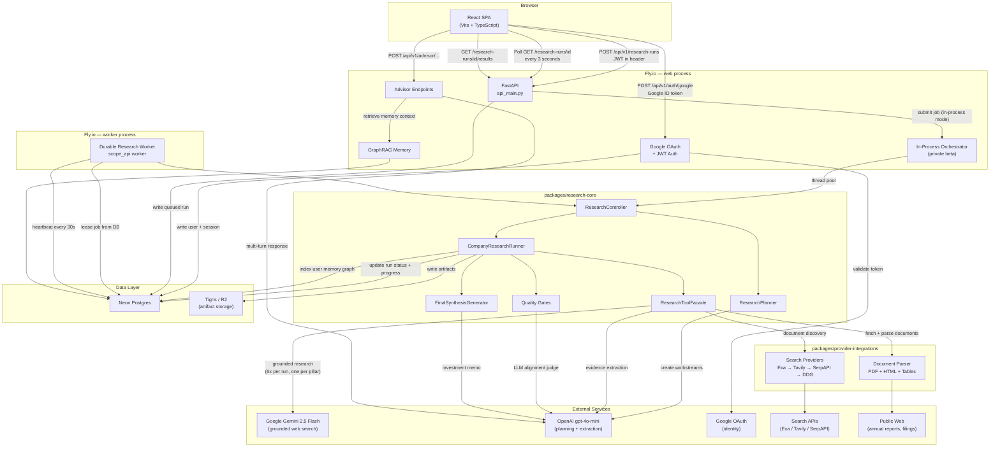
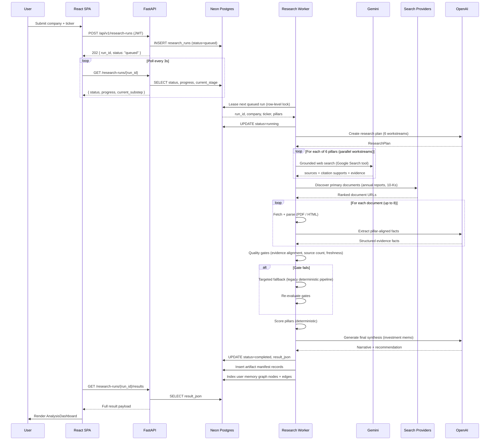
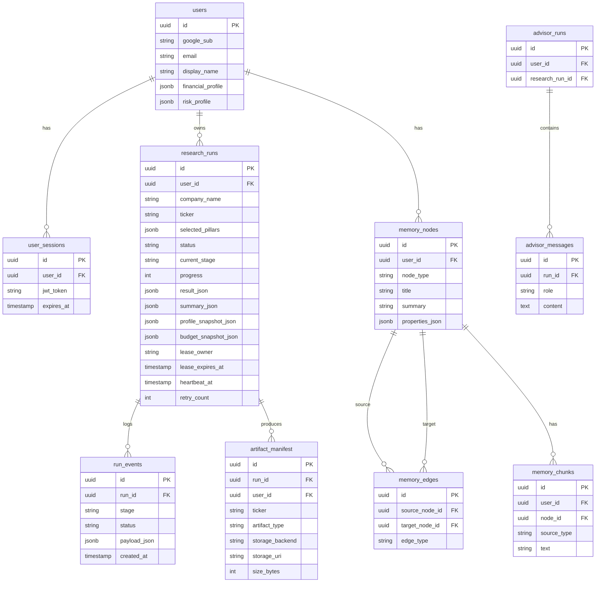

# Scope — Systems Design Overview

## What It Is

Scope is a stock research orchestrator. A user submits a company name and ticker; the system
runs a multi-stage AI pipeline across six equity due diligence pillars and returns a structured
investment memo with evidence citations, a scorecard, and a personalized recommendation.

---

## High-Level Architecture



---

## Request Lifecycle — "Start Research"



---

## Research Pipeline — Stage by Stage

| # | Stage | What Happens | LLM Used | Fallback |
|---|-------|-------------|----------|---------|
| 1 | **Planning** | Generate 6 workstreams with search focus and required evidence per pillar | GPT-4o-mini | Deterministic fixed plan |
| 2 | **Grounded Research** | Gemini runs Google Search and returns grounded answers with citation supports | Gemini 2.5 Flash | `status=unavailable` if no key |
| 3 | **Document Discovery** | Discover + rank annual reports, 10-Ks, transcripts via search | — | Skip if search fails |
| 4 | **Document Parsing** | Fetch PDFs/HTML, extract text chunks + financial tables | GPT-4o-mini (optional) | Deterministic keyword extraction |
| 5 | **Evidence Assembly** | Merge grounding evidence + document evidence per pillar | — | — |
| 6 | **Quality Gates** | Score alignment, check source count, freshness, primary docs, financial tables | GPT-4o-mini (LLM judge, optional) | Skip judge if no key |
| 7 | **Targeted Fallback** | Run legacy deterministic pipeline for weak pillars only | — | Full legacy pipeline if all pillars weak |
| 8 | **Pillar Scoring** | Score each of 6 pillars + compute overall score and recommendation | — | Always deterministic |
| 9 | **Final Synthesis** | Write investment memo with personalized recommendation | OpenAI | Run fails if synthesis errors |

---

## Data Model



---

## Process Groups (Fly.io)

```
┌──────────────────────────────────────────┐
│  Fly app: scope-api                      │
│                                          │
│  ┌──────────────────┐                   │
│  │  web (1x)        │  public HTTP :8000│
│  │  api_main.py     │  health checks    │
│  │  shared-cpu-1x   │  CORS, rate limit │
│  │  1 GB RAM        │  auth + advisor   │
│  └──────────────────┘                   │
│                                          │
│  ┌──────────────────┐                   │
│  │  worker (1x)     │  no public HTTP   │
│  │  scope_api.worker│  leases DB jobs   │
│  │  shared-cpu-2x   │  heartbeat 30s    │
│  │  2 GB RAM        │  restart=always   │
│  └──────────────────┘                   │
└──────────────────────────────────────────┘
         │                    │
         ▼                    ▼
   Neon Postgres        Tigris (S3)
   (pooled conn)        (artifacts)
```

---

## Six Research Pillars

| Pillar | What It Assesses |
|--------|-----------------|
| **Macro & Industry** | Sector tailwinds, competitive dynamics, regulatory environment |
| **Economic Moat** | Durable competitive advantage, switching costs, network effects |
| **Financial Engine** | Revenue, margins, cash flow, balance sheet health |
| **Management & Capital Allocation** | Leadership quality, capital deployment, shareholder returns |
| **Valuation** | Trading multiples, intrinsic value, margin of safety |
| **Technical Analysis** | Price trend, momentum, support/resistance levels |

---

## Advisor (Post-Research)

After a research run completes, users can open an advisor conversation anchored to that run.

```
User message
    ↓
Retrieve memory context
    ├── Graph nodes for this company (memory_nodes WHERE source_ref = run_id)
    ├── Text chunks from evidence (memory_chunks)
    └── Profile snapshot from run
    ↓
Prompt = system context + memory + conversation history + user message
    ↓
OpenAI (GPT-4o or configured model)
    ↓
Response persisted to advisor_messages
    ↓
Returned to user
```

---

## Key Constraints & Limits

| Constraint | Value | Where Configured |
|-----------|-------|-----------------|
| Max active research runs per user | 2 | `RESEARCH_MAX_ACTIVE_RUNS_PER_USER` |
| Daily research limit per user | 10 | `RESEARCH_DAILY_LIMIT_PER_USER` |
| Worker lease duration | 300s | `RESEARCH_LEASE_SECONDS` |
| Heartbeat interval | 30s | `RESEARCH_HEARTBEAT_SECONDS` |
| Max document candidates | 8 | Hard-coded in runner |
| Max evidence facts per document | 24 | Hard-coded in parser |
| Max grounded facts per signal | 6 | Hard-coded in grounding |
| API rate limit | 30 req/min | `RESEARCH_RATE_LIMIT_PER_MIN` |
| Request body max | 26 MB | `SCOPE_MAX_BODY_BYTES` |
| Artifact retention | ephemeral | `ARTIFACT_RETENTION_MODE` |
| Source freshness threshold | 365 days | `SCOPE_RESEARCH_SOURCE_STALE_DAYS` |
